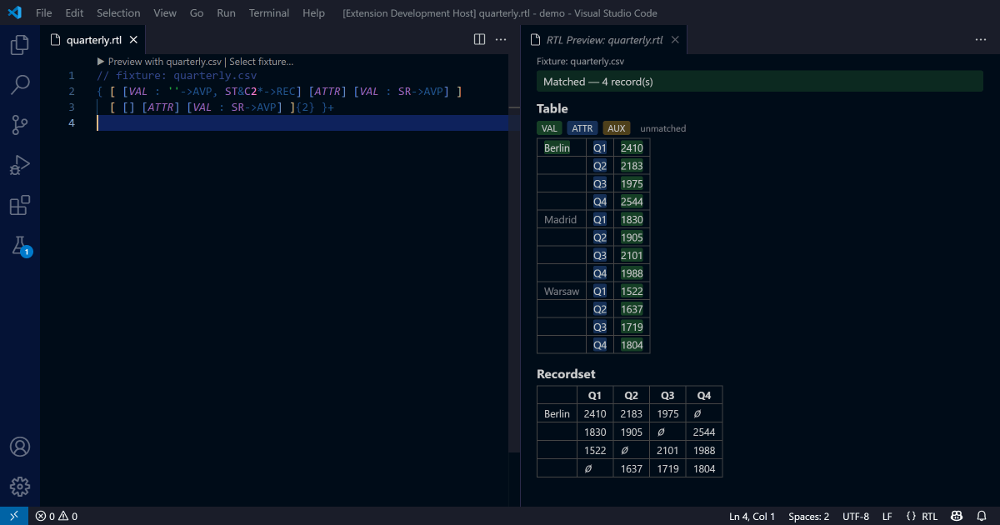
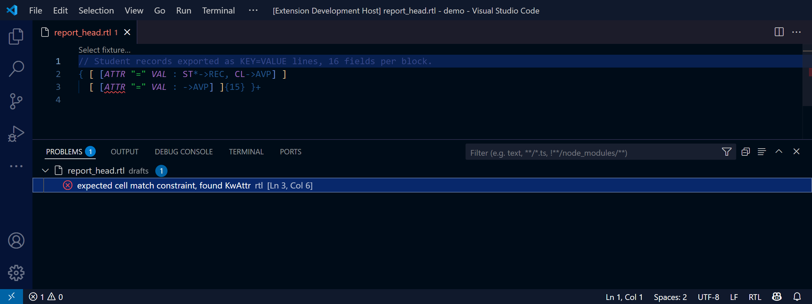
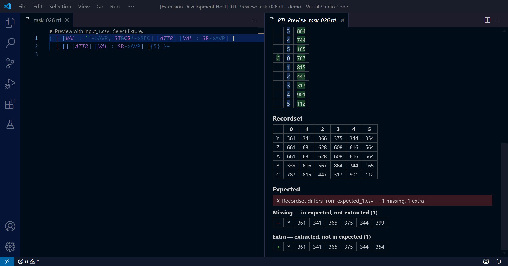
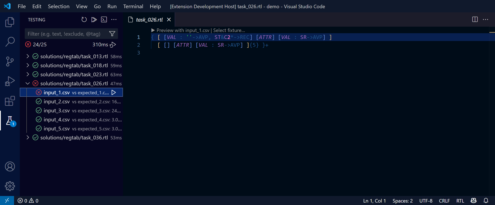
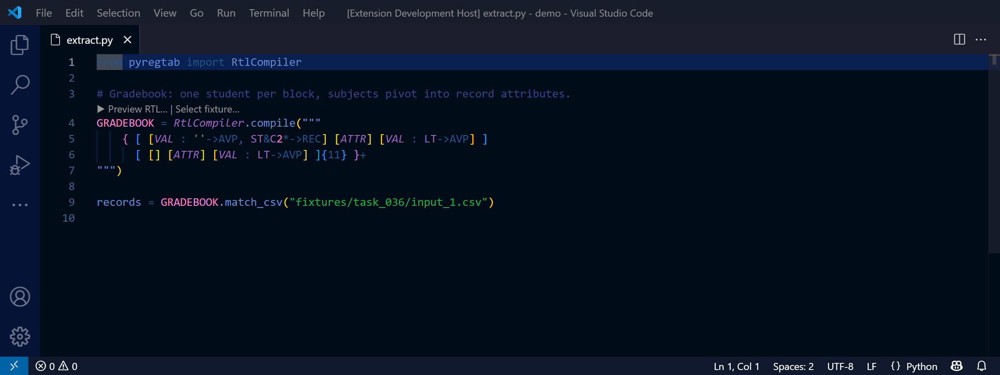

# RegTab — Regular Table Language

**RegTab matches tables the way RegEx matches text.** RTL (Regular Table Language)
is the pattern DSL for extracting structured records from arbitrarily-shaped
tables, developed by the [RegTab](https://regtab.github.io/) project.

RTL patterns describe the layout of a table (subtables, rows, cells), constrain
cell content, and specify how matched cells are interpreted into a record set.
This extension works with **any** RegTab implementation — jRegTab (Java),
pyRegTab (Python) — and with standalone `.rtl` files that are not tied to a host
runtime at all.

```rtl
// Airline on-time performance: header row + repeated data rows
[ [] [VAL: 'AIRLINE'->AVP]+ ]
[ [VAL: 'AIRPORT'->AVP] [VAL: (COL,ROW,CL)->REC, 'ND'->AVP ' ' VAL: 'MON'->AVP]+ ]+
```



## Installation

Open the Extensions view (`Ctrl+Shift+X`), search for **Regular Table
Language**, and click Install — or run:

```
ext install regtab.regtab
```

Syntax highlighting and snippets work out of the box. Compile diagnostics and
the live match preview are powered by `rtl-lsp`, a native language server:
platform-specific builds bundle it automatically, and on any other platform you
can point `rtl.server.path` at your own `rtl-lsp` binary — see the
[FAQ](https://github.com/regtab/vscode-rtl/blob/main/docs/faq.md).

## Features

- **Compile diagnostics as you type** — powered by `rtl-lsp`, a standalone
  native language server built on the RegTab Rust core. Errors are underlined
  at the exact source position with the compiler's message — in `.rtl` files
  **and inside RTL string literals in Python/Java** (escapes and text-block
  indentation are mapped back correctly). `EXT('…')` predicates are never
  reported as unbound while editing standalone files (they bind to the host
  runtime only at run time). Platform-specific builds bundle the server; on
  other platforms point `rtl.server.path` at your own binary, or use the
  extension with highlighting only.

  

- **Live match preview** — run the pattern against a CSV fixture: each
  matched cell-derived item's segment is colored by role (VAL / ATTR / AUX)
  inside the cell text, the extracted recordset is shown alongside, and the
  preview re-runs as you edit. Fixtures bind via a `// fixture:` directive
  (paths resolve against the file's directory; `${workspaceFolder}` is
  substituted), the *RTL: Select Fixture…* command, or the
  `rtl.fixtures.input` glob template for whole directories of patterns
  (with snippet-style `${basename/regex/replacement/}` transforms for host
  files whose names don't literally match the fixture layout). Works on
  `.rtl` files **and on RTL string literals in Python/Java**
  (`RtlCompiler.compile`, `@RtlSource`, `language=RTL` markers) via a
  CodeLens on each literal.
- **Expected-result diff** — bind an expected CSV to a fixture (an
  `// expected:` directive or the `rtl.fixtures.expected` template) and the
  preview turns red/green: it diffs the extracted recordset against the
  expected rows (unordered multiset by default; header and row-order
  policies are settings) and lists the missing and extra records.

  

- **Test Explorer** — every pattern × fixture pair with an expected result
  appears in VS Code's Testing view: run a whole directory of patterns and
  get pass/fail with the diff on failures — regression checks for pattern
  catalogs, no Python or JDK required.

  

- **Canonical form on demand** — the *RTL: Show Canonical Form* command opens
  a read-only view of the normalized pattern (inherited actions pushed down
  to atoms): see what the compiler actually understood, or compare two
  differently written patterns for equivalence. It is intentionally not a
  formatter — canonicalization drops comments and layout, so your source is
  never touched.
- **Hover reference** on every RTL keyword — constraint semantics, action
  effects, extractor behavior — generated from the normative RTL reference.
- **Context-aware completion** — actions after `->`, extractors after `=`,
  declared `$fragments`, known `#'tags'`, settings inside `<…>`.
- **`$fragment` navigation** — go to definition, find references, rename,
  and an Outline view of fragments, subtables and rows.
- **Syntax highlighting for `.rtl` files** — keywords, actions, providers,
  extractors, fragments (`$NAME`), tags (`#'…'`), strings, comments, quantifiers.
- **RTL inside Python strings** — literals passed to `RtlCompiler.compile("…")`
  (single-line, triple-quoted, and raw strings) are highlighted as RTL.
- **RTL inside Java strings** — `RtlCompiler.compile("…")`, the `@RtlSource("…")`
  annotation, Java 15+ text blocks (`"""…"""`), and literals marked with
  `/* language=RTL */`.
- **Snippets** for frequently used combinations: `ST*->REC`, `(SC{n}, SR)->REC(n)`,
  `^COL->AVP`, `('LABEL')->AVP`, `CL->JOIN(0)`, `-AV->PREFIX(', ')`, table and
  fragment skeletons, settings, conditional cells.
- **Editor basics** — bracket matching and auto-closing for `[] {} () <>`,
  `//` line comments.

No Python, JDK, or other runtime is required — the extension is fully
self-contained.

## Embedded RTL at a glance

Highlighting, diagnostics, and the match preview also work on RTL string
literals inside host-language code:

### Python

```python
from pyregtab import RtlCompiler

pattern = RtlCompiler.compile("""
[ [ATTR]+ ]
[ [VAL : ST*->REC]+ ]+
""")
```

### Java

```java
@RtlSource("""
    [ [ATTR]+ ]
    [ [VAL : ST*->REC]+ ]+
    """)
String pattern;

var atp = RtlCompiler.compile("[ [VAL: 'LABEL'->AVP] ]+");
```

*(TextMate limitation: the opening quote must be on the same line as
`RtlCompiler.compile(` / `@RtlSource(`.)*




## Documentation

- [Binding fixtures and expected results](https://github.com/regtab/vscode-rtl/blob/main/docs/fixtures.md) —
  the `// fixture:` / `// expected:` directives, the `rtl.fixtures.*`
  templates with name transforms, input↔expected pairing, comparison
  semantics, and how the Test Explorer discovers pattern × fixture pairs.
- [FAQ and behavior notes](https://github.com/regtab/vscode-rtl/blob/main/docs/faq.md) —
  why there is no formatter, permissive `EXT('…')` handling, embedded-literal
  limitations, running your own `rtl-lsp`, troubleshooting.
- [RTL reference](https://github.com/regtab/pyregtab/blob/main/docs/rtl-reference.md) —
  the language itself: constraints, actions, providers, extractors. The
  in-editor hover documentation is generated from this document.

## Roadmap

- Excel fixtures in the preview (cell styles that CSV cannot carry).
- Semantic highlighting refinements on top of the TextMate grammar.

## Grammar version

Highlighting mirrors the normative RTL grammar `RTL.g4` from **jRegTab 0.5.0**
(RTL tokens are case-insensitive). Any change to the normative grammar must be
accompanied by a matching tmLanguage update in this repository — CI enforces
keyword-coverage sync.

## Related projects

- [jRegTab](https://github.com/regtab/jregtab) — Java implementation of RegTab.
- [pyRegTab](https://github.com/regtab/pyregtab) — Python implementation of RegTab (Rust core).

## License

[MIT](LICENSE)
